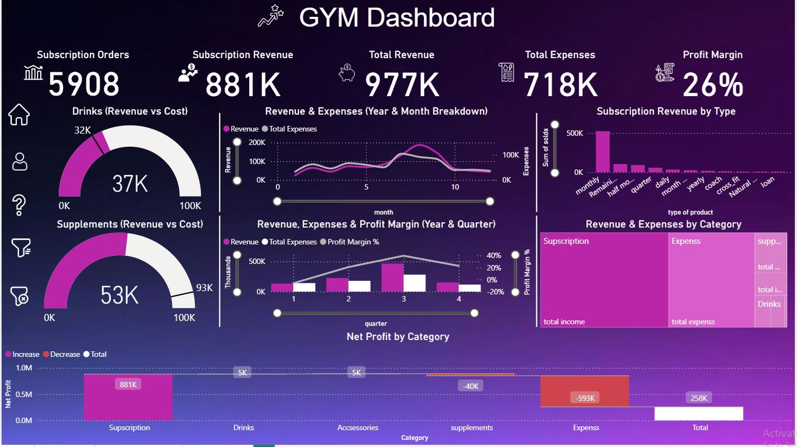
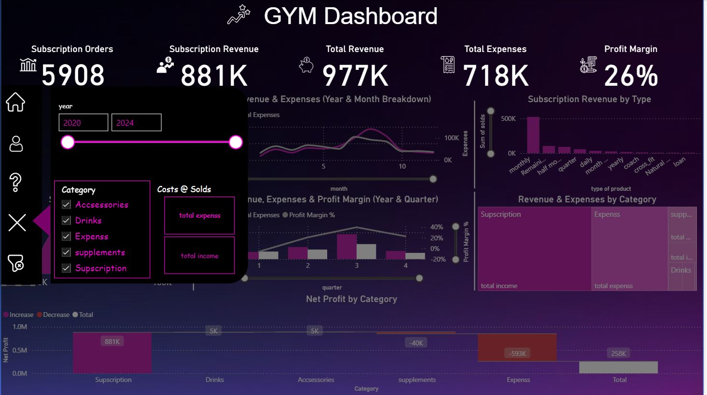
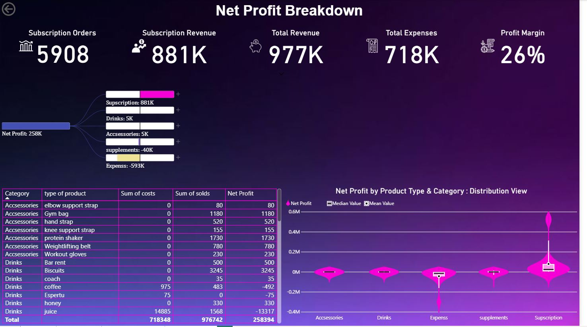
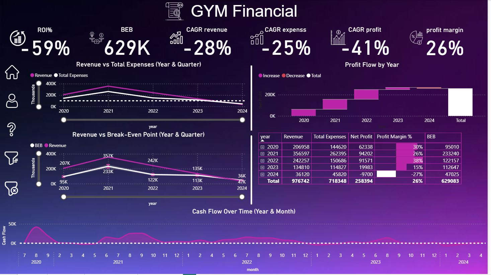
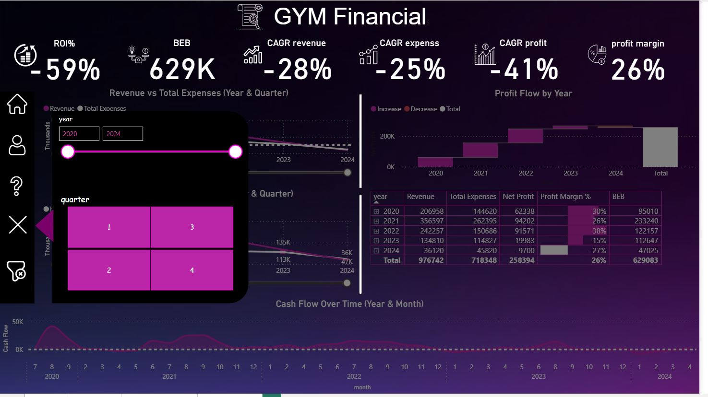
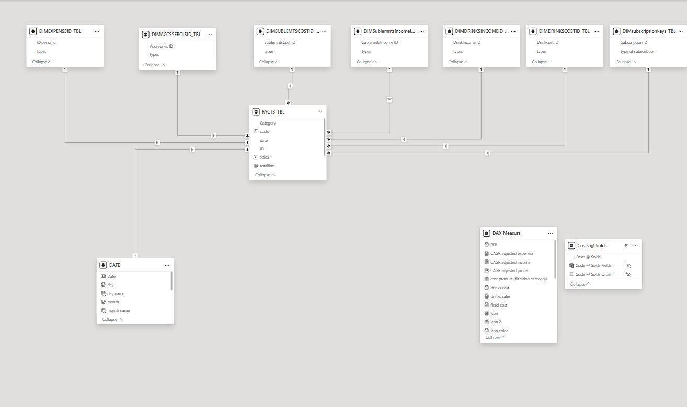

## 챌 The Challenge

Imagine being faced with 5 years of paper invoices, receipts, and membership logs and being asked to derive precise administrative and financial insights.

This was the core challenge: to digitize, structure, and analyze a massive volume of offline data to uncover the true financial health of the business, which was previously invisible to the management.

---

## ⚙️ Process & Methodology

The project was executed in three critical phases:

### 1. Data Entry & Structuring

* Manually digitized 5 years of paper records into a structured dataset.

* Designed and implemented a robust **Star Schema** (1 Fact Table + Dimension Tables) to create a reliable single source of truth for all business metrics.

---

### 2. Data Cleaning & ETL

* Performed extensive ETL processes to clean, normalize, and validate the raw data.

* Conducted statistical analysis to identify outliers, which were confirmed as valid data points representing two distinct segments: **Regular Operations** vs. **High-Value Transactions**.

* Ensured 100% data quality and standardized formats before loading into Power BI.

---

### 3. Dashboard Design – 3 Modules

An interactive Power BI dashboard was built, segmented into three key analytical views:

* **General Overview:** A high-level look at overall performance, KPIs, and business health.

* **Products Analysis:** A deep dive into revenue and performance of Supplements, Beverages, and Subscriptions.

* **Financial Analysis:** Focused on profitability, costs, Break-Even Point, ROI, and CAGR.

## 🛠️ Tools Used

* **Microsoft Excel:** For initial data entry, cleaning, and preparation.

* **Power BI:** For Data Modeling (Star Schema), advanced DAX calculations (KPIs), and interactive dashboard visualization.

## 📌 Key Insights & Discoveries

The analysis revealed critical insights that were completely hidden within the paper records:

* **The Profitability Illusion:** The gym showed a surface-level **Profit Margin of 26%**, but this was dangerously misleading. The **Compound Annual Growth Rate (CAGR) was -28%**, indicating the business was in a state of year-over-year decline.

---

* **Ineffective Management:** Management was focused on cutting costs (which decreased by 25% annually), yet overall losses continued to increase. This proved that the cost-cutting decisions were inefficient and harming sustainable growth.

---

* **Critical Revenue Leakage:** A total of **93,000 EGP** was identified as unrecorded or uncollected revenue due to poor billing and administrative practices.

---

* **High Customer Churn:** Over **80% of all subscriptions were monthly**, signaling a severe customer retention problem and high churn rate.

---

* **Product Performance Failure:**

    * **Supplements:** Generating a **43% net loss**, indicating a critical issue with pricing or inventory management.

    * **Beverages:** Showed only **+15% growth**, a major untapped opportunity for a high-margin, daily revenue stream.

## 💡 Recommendations

Based on the analysis, the following actionable recommendations were provided to management:

1.  **Immediate Re-pricing & Inventory Control** for the supplements category to stop the 43% loss.

---

2.  **Leverage Beverages** as a primary, high-margin daily profit channel.

---

3.  **Diversify Subscription Plans** (e.g., Quarterly, Annual) to improve customer retention (reduce churn).

---

4.  **Implement Strict Billing Controls** to capture the leaked revenue.

---

5.  **Shift Focus** from arbitrary cost-cutting to sustainable, profit-driven growth strategies.

📊 Dashboard Preview

Here is a look at the different modules of the final dashboard:
Example:

🔗 Live Demo

Explore the full interactive dashboard for this project:

[**View the Interactive Dashboard Live Here**](https://app.powerbi.com/view?r=eyJrIjoiYzY5ZmVjZWUtYjg2NC00YWQ4LTllZGEtNDM4YjkzMjY2YTI1IiwidCI6IjJiYjZlNWJjLWMxMDktNDdmYi05NDMzLWMxYzZmNGZhMzNmZiIsImMiOjl9)

(Note: This project is based on 100% real-world data, successfully transformed from manual paper records.)

✅ Conclusion

This analysis highlights the critical importance of data segmentation (like separating high-value campaigns) and well-defined KPIs in marketing analytics. These practices enable clearer insights into campaign effectiveness and facilitate better-informed strategic decisions, revealing patterns often missed by surface-level observation.

💬 Feedback Welcome!
This project demonstrates how data analysis can turn chaos into actionable decisions. If you have any questions or suggestions, please feel free to open an issue!

Thanks for your time! 🙌
